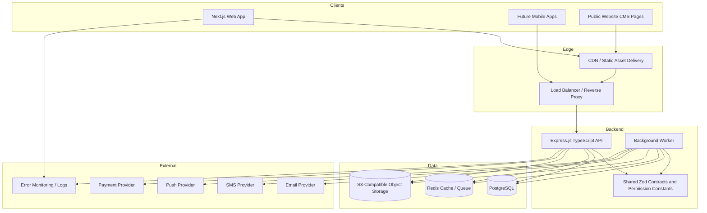
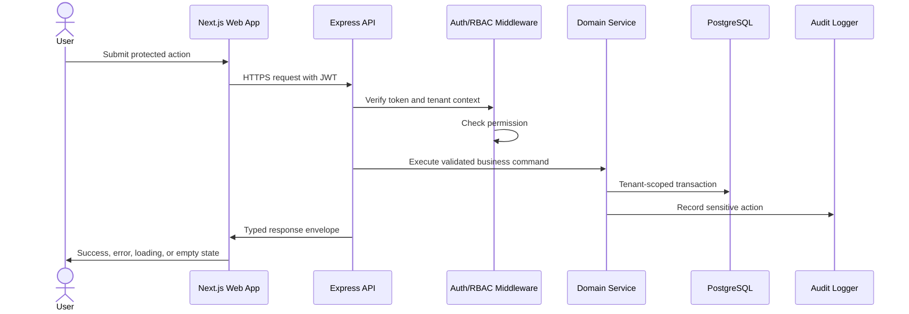
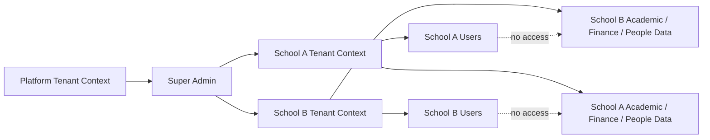
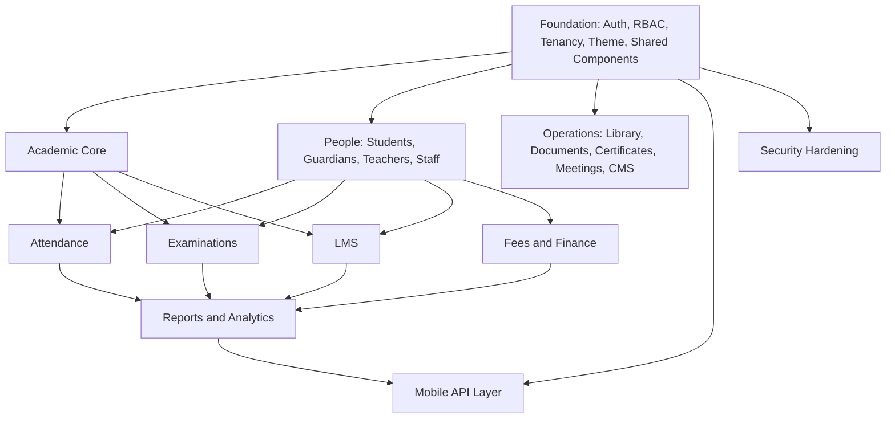

# Architecture Diagram

Project: School ERP Management System  
Phase: 1 - System Architecture

## Logical System Diagram

## Request Flow

## Multi-School Data Isolation Diagram

## Module Dependency Diagram

